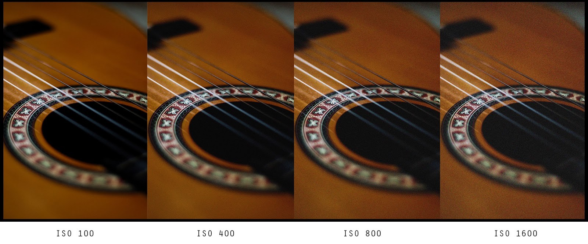

# 1. Conceptos básicos de fotografía

Antes de tratar el tema del vídeo de una manera digital, debemos repasar algunos conceptos básicos de la fotografía, ya que muchos de los efectos que vemos en el cine no se realizan utilizando un ordenador, si no simplemente jugando con la luz y otros aspectos que veremos a continuación.

## Tiempo de exposición

Cuando hablamos del tiempo de exposición, nos referimos a la cantidad de tiempo que el sensor de una cámara se queda abierto recibiendo luz del exterior para plasmarlo en un rollo fotosensible o utilizando un sensor fotosensible que convierta la información en señales eléctricas.

Cuanto mayor sea nuestro tiempo de exposición, más iluminada quedará la toma. Sin embargo, debemos tener en cuenta que normalmente el tiempo de exposición suele ser bajo y se juega con otros factores ya que si el sensor permanece abierto mucho tiempo, cualquier movimiento quedará registrado, por lo que es normal que tengamos una fotografía borrosa si no disponemos de un trípode u otro tipo de soporte.

Aquí podemos ver un ejemplo de como quedaría una toma con un tiempo de exposición de 5 minutos bajo una noche cerrada. En este caso se corresponde con la lluvia de Gemínidas de diciembre de 2013 vista desde El Teide.

[Fuente de la imagen](https://www.flickr.com/photos/starryearth/11402957174/in/album-72157634760969777/)

## Sensibilidad

El concepto que tratamos anteriormente se basa en el tiempo que un sensor captura luz, sin embargo, con la sensibilidad nos referimos a la cantidad de luz que debe captar un sensor, la cual se puede aumentar a través de software. Cabe destacar que en las cámaras de carrete esta característica no existía, puesto que venía implícito en el rollo de película que se comprase, ya que en ese caso dependía de la capacidad sensitiva del material.

A mayor sensibilidad, más luz se genera en la toma. Sin embargo, en este caso, se genera un ruido en la imagen según se va aumentando el valor de la sensibilidad. Por ello, siempre se recomienda no llevar este valor a sus extremos puesto que obtenemos una imagen que no se corresponde en la realidad. Este lo podemos mejorar si jugamos con otros aspectos como el tiempo de exposición o la apertura que se explica a continuación.

Aquí se ve un ejemplo de como se vería la misma imagen en la que se va aumentando la sensibilidad, uedando en valores bajos perfectamente nítida y en valor altos algo granulada, aspecto que suele destacar mucho en fotos con el cielo en noche cerrada.

[Fuente de la imagen](http://www.topfotografia.net/Fotografia/teoria-de-la-fotografia/sensibilidad-iso/sensibilidad-iso.html)

## Apertura

El último concepto que analizaremos es la apertura, relacionado con la cantidad de luz que deja pasar el diafragma del obturador hasta el sensor. Se mide con la letra f y un valor bajo significa una mayor apertura. Cuanto mayor sea la apertura posible más iluminada quedará nuestra toma y podremos, por ejemplo, reducir el tiempo de exposición que la fotografía no salga movida o reducir el valor de la sensibilidad para eliminar en lo posible el ruido generado.

En algunos casos, es posible obtener una apertura menor a 1, gracias a jugar con cambios en la distancia focal, aspecto con el que la apertura va estrechamente ligada, ya que se encarga de ofrecernos profundidad de campo. En la siguiente imagen se puede apreciar un fotograma de la película Barry Lyndon (1975) de Stanley Kubric en que se iluminó esa escena utilizando únicamente las luces de las velas, para lo que fue necesario contar un con un objetivo con una apertura de f/0.7.

[Fuente de la imagen](http://stanleykubrick.neocities.org/barrylyndoncandles.html)