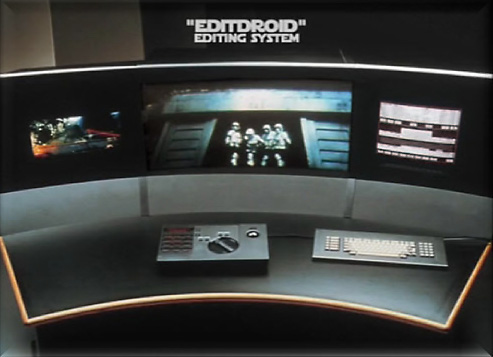

# 5. Edición no lineal

En el capítulo anterior tratamos la edición lineal, es decir, aquella en la que recorríamos todos los fotogramas de una cinta hasta llegar al deseado. En este apartado hablaremos de la edición NO lineal, es decir, aquella en la que podemos acceder hasta la parte deseada de un vídeo sin importar el resto. Existen 5 generaciones distintas hasta llegar a los programas de edición de vídeo actuales.

## Primera generación

También llamada la generación de la videocinta. En estos casos, se contaba con varios reproductores de cinta, hasta 27 y normalmente VHS, y un grabador. El funcionamiento consistía en seleccionar las escenas que se quisiesen en cada uno de los reproductores y cambiar de fuente según correspondiese, de manera que pareciese que la toma en el grabador era continua.

## Segunda generación

También llamada la generación del videodisco. La introdujo George Lucas en 1984 con su sistema Editdroid, y se basaba en el mismo principio que la primera generación, salvo que ahora se utilizaban cuatro máquinas reproductoras, dos para la pista A y otros dos para la pista B, en el que uno daba el vídeo y el otro el audio, y ahora se trataba de CDs y no de cintas. No tuvo mucho éxito debido en mayor parte a la lentitud que existía al grabar en disco.

[Fuente de la imagen](http://fraser-harrison-postproduction.blogspot.com.es/2013/03/what-was-editdroid.html)

## Tercera generación

Se puede denominar la generación del disco magnético, y no es hasta 1988 cuando aparece en escena. En este momento, todo el material, desde la fuente, los efectos y el resultado final, se manipulaba y almacenaba en el ordenador. Es ahora cuando empezamos a ver a empresas como Avid en el sector. Sin embargo, a pesar de parecerse a los sistemas actuales, muy pocos estudios trabajaban con ellos por varias razones, la primera de ellas radicaba en que el tiempo de renderizado era excesivo para obtener la imagen final. La segunda razón se basaba en la cantidad de problemas que existían a la hora de digitalizar las imágenes, ya que la mayoría se grababan de manera analógica. Y la tercera era el problema que existía con el espacio de almacenamiento, ya que una hora de vídeo en una calidad decente podía llegar a ocupar 8.2 GB, algo que hoy en día nos parecería poco, pero que para la época era algo desorbitado, ya que el precio del gigabyte se situaba en torno a los 1.000 dólares, por lo que el gasto solo en soporte de almacenamiento podía llegar a ser muy muy elevado.

## Cuarta generación

Llegamos a la generación en la que las salas _offline_ y _online_ se unen. Es decir, ahora el material que se grababa con una cámara se podía editar en vivo y en directo desde una única sala de ordenadores. Las capacidades con las que contaban hacía que no fuese posible añadir grandes efectos visuales, pero si otros más destinados a la televisión como añadir pistas de audio, títulos, algunos fundidos, etc. Su principal limitación era la escasa potencia con la que contaban, ya que no podían llegar a editar en 4K, resolución que es el estándar con el rollo de 35mm.

## Quinta generación

Última generación, por ahora, en el concepto de edición de vídeo. Es lo que conocemos actualmente gracias a los programas de edición y creación de vídeo como el Magix Vegas, Adobe Premiere o Cinema 4D entre muchos otros. Ahora se nos permite por utilizar todo el material grabado por las cámaras y procesarlo en bruto, o incluso crear nuevos personajes sin tener ninguna base física del mismo.

[Fuente de la imagen](http://www.karpeton.com/Shop/product.php?id_product=18)