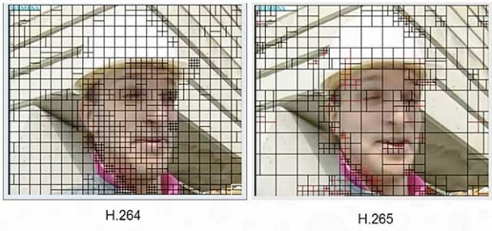
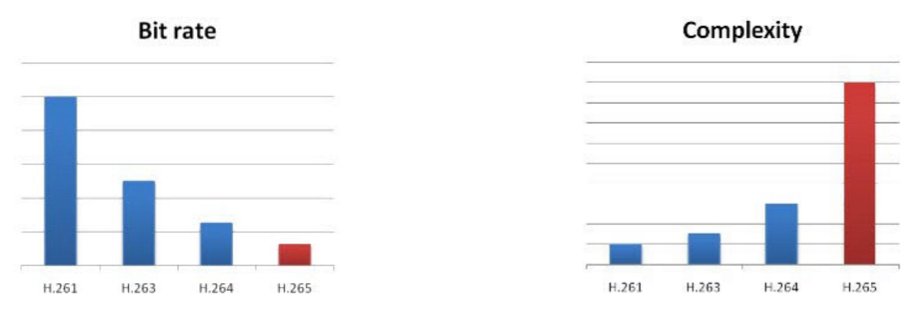

# 8. Códecs

Hasta ahora habíamos hablado del vídeo grabado y del generado por ordenador como si este se almacenase en un fichero sin realizar operaciones previamente. Sin embargo, esto no es del todo cierto porque, a pesar de que existen formatos de vídeo en el que no hay compresión, lo normal es que se comprima el vídeo para que este no ocupe un espacio elevado en disco. Para conseguir esto, se utilizan los códecs, abreviación de codificador-decodificador, que no es más que un programa que permite codificar o decodificar un flujo de datos digital, el cual normalmente lleva asociado una pérdida.

En la actualidad los más extendidos son el H.264, el H.265 y el VP9. En el caso del H.264 hablamos de una generación anterior de códecs, mientras que los otros dos se consideran como de nueva generación y férreos competidores entre ellos.

## H.264

Este códec es probablemente el más extendido en la actualidad, tanto en formatos físicos como los Blu-Rays, como en soportes digitales como Vimeo o Netflix. Tiene las desventajas que es un códec privativo y no es tan eficiente como los de nueva generación. Su funcionamiento es muy sencillo, ya que se basa en dividir la cada fotograma en cuadros desde 4x4 píxeles hasta 16x16 y almacenar esa información como si de una única unidad se tratase, utilizando 9 tandas de un algoritmo. Para mostrarlo posteriormente, necesitaremos ejecutar otra vez esas 9 tandas de algoritmos, lo que nos permite devolver la imagen a su estado original. Sin embargo, al ser algoritmos por aproximación siempre se pierde algo de información.

## H.264 vs H.265

Ambos los administran la misma compañia, la MPEG LA. Se diferencian entre ellos en que el H.265 puede comprimir mucho más, más del doble, de lo que puede hacer el H.264. Para ello, necesita ejecutar 35 tandas de algoritmos, tanto para almacenar los píxeles como para recuperarlos, lo que ocasiona una pérdida un poco mayor y la necesidad de contar con un procesador más potente para poder reproducir un vídeo, ya que ahora necesita ejecutar casi 4 veces más algoritmos para conseguir la misma información. Sin embargo, consigue reducir mucho el peso de un vídeo, lo que hace que sea un candidato perfecto para el streaming. Todo esto se consigue codificando la imagen en cuadrados de 4x4 píxeles hasta 64x64, a diferencia del H.264, donde solo se llegaba hasta 16x16 píxeles.

[Fuente de la imagen](http://www.trustedreviews.com/opinions/h-265-vs-vp9-4k-video-codes-explained)

## H.265 vs VP9

La principal y más importante diferencia entre estos dos códecs es que el primero de ellos es de pago y el segundo no, ya que Google, su principal desarrollador, decidió compartirlo de manera gratuita. Esto ha provocado que muchas empresas paguen a MPEG LA solo por el códec H.264, ya que es el más extendido y prácticamente casi cualquier dispositivo moderno es capaz de reproducirlo, para lo contenidos de baja resolución, y en los casos de mayor resolución como FullHD o 4K, utilicen el VP9. Sin embargo, esta es prácticamente la única diferencia, ya que su calidad y capacidad para comprimir es muy similar, salvo que el VP9 cuando codifica, es capaz de hacer con polígonos de hasta 64x64 píxeles, pero que pueden ser rectángulos, cosa que el H.265 tenían que ser cuadrados sí o sí.

[Fuente de la imagen](http://www.trustedreviews.com/opinions/h-265-vs-vp9-4k-video-codes-explained)