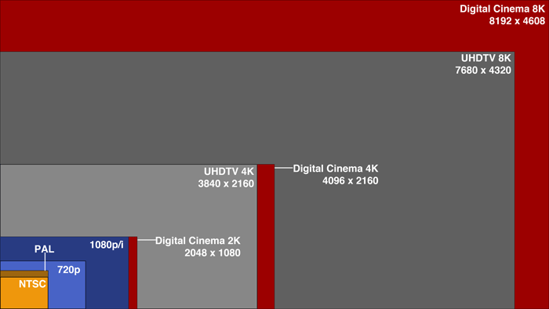

# 2. Conceptos básicos de vídeo

En el capítulo anterior vimos varios conceptos de la fotografía que son igualmente aplicables cuando hablamos de capturar vídeo. En este caso, veremos dos conceptos que se relacionan exclusivamente con el vídeo, pero que en fotografía se utilizan de manera diferente.

## Resolución

La resolución de una imagen hace referencia a la cantidad de píxeles que hay en un fotograma, multiplicando su cantidad horizontal por la vertical. En el caso de la fotografía se utilizan los megapíxeles para referirnos a la resolución de una imagen, mientras que en el vídeo se utilizan los conceptos que aparecen en la imagen de debajo.

Full HD y 4K son los dos más extendidos hoy en día, ya que prácticamente cualquier televisor y cualquier cámara es capaz de reproducir o grabar a una cantidad de píxeles totales de 1920x1080, lo que conforman un total de 2.073.600 de píxeles, unos 2MP más o menos. En el caso del 4K, es el estándar que se aplicará en un futuro próximo, en el cual la imagen tiene 3840x2160 píxeles, que conforman un total de 8.294.400, unos 8MP, 4 veces más resolución que con el Full HD.

En el caso del 4K hay que destacar que en el cine esta resolución es un poco mayor, ya que antiguamente, cuando se digitalizaba una película de un rollo de 35mm, la resolución que se obtenía era de 4096x2160, ligeramente superior en el valor horizontal. Por ello, se suele utilizar la nomenclatura UHD para la resolución 4 veces superior al Full HD, aunque ya el 4K se está usando indistintamente.

[Fuente de la imagen](http://elvideologo.blogspot.com.es/2013/10/resoluciones-y-definiciones.html)

## Fotogramas por segundo

Este concepto hace referencia a la cantidad de imágenes estáticas (fotogramas) que hay en un segundo de vídeo. En el caso de la fotografía, se relaciona con el tiempo de exposición, ya que en el caso del vídeo, su tiempo de exposición viene marcado por la cantidad de fotogramas por segundo que es capaz de capturar.

Los valores clave que se dan son los siguientes:

    * 24 fps: es la cantidad que se utiliza en el cine, ya que se calculó que el ser humano tiene sensación de movimiento si se muestran entre 20 y 23 fotogramas por segundo. Por ello, se redondeó a 24 y se utiliza como estándar.
    * 60 fps: es una de los valores que se está tomando como estándar tanto a la hora de grabar vídeo como de jugar a videojuegos, etc.
    * ~200 fps: es la cantidad mínima aproximada en la que un ser humano es capaz de distinguir un fotograma. Para este cálculo se utilizaron pilotos militares, los cuales fueron capaces de distinguir una imagen entre otras 225 que se mostraban en un solo segundo.

[Fuente de la imagen](http://frame.icapemay.com/what-is-frame-rate-per-second/)