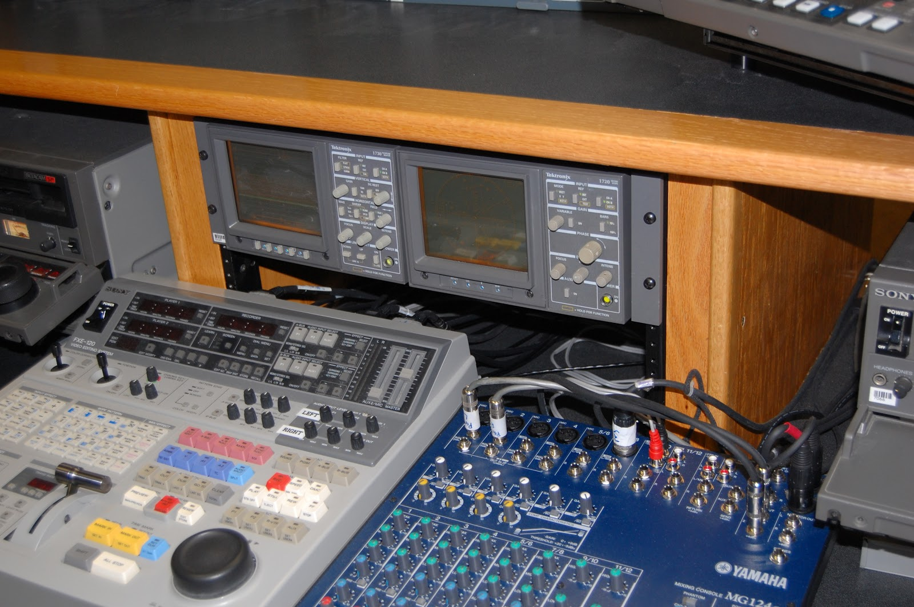

# 4. Edición lineal

Ahora que hemos definido que es la edición, es conveniente apuntar los distintos tipos que hay. Principalmente se engloban en dos grupos, lineal y no lineal, según el modo en el que se puede acceder a un fotograma concreto de un vídeo. En este caso explicaremos en que consiste la edición lineal.

Como su propio nombre indica, la edición lineal es aquella en la que para acceder a un fotograma no podemos hacerlo de una manera directa, si no que tenemos que recorrer todos los fotogramas previos hasta llegar al deseado. Para ello, contabamos con mínimo dos magnetoscopios en el que uno reproducía y pasaba esa información al otro que grababa. Debido a esto, se utilizaban múltiples reproductores y un grabador al que le entraban las fuentes de vídeo de los otros magnetoscopios, los cuales podían añadir efectos como fundidos o cortinillas.

Con el paso del tiempo, apareció el código de tiempo, el cual añadía al vídeo una pista con el minuto, segundo y fotograma exacto en el que se encontraba el reproductor sobre la cinta. Esto suponía una gran ventaja, ya que en este sistema, si querías aplicar un efecto en el fotograma 500 de 10.000 que componían un vídeo, tenías que recorrer todos hasta llegar al 500, aplicar el efecto, y después grabar de nuevo desde ahí hasta el 10.000 final. Por ello, el código de tiempo permitía un avance más rápido, ya que permitía saber con exactitud el cuadro o fotograma concreto.

[Fuente de la imagen](https://www.emaze.com/@ALQFRTFQ/Edici%C3%B3n-No-lineal)