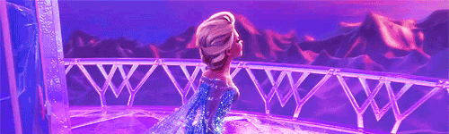

# 7. Frozen

Para poder ilustrar mejor la magnitud de potencia de cálculo que se necesita para renderizar un vídeo, el mejor caso actual es el de la película de Pixar, Frozen. En esta película cada copo de nieve está formado por miles de miles de polígonos, y al estar colocado en un entorno 3D, el ordenador tiene que simular también la física de los mismos para generar una sensación de nieve real. Sin embargo, este es solo un ejemplo de los cálculos más pesados que realiza.

Para poder generar un único fotograma del GIF que se encuentra al final de esta página, un ordenador tardaría unas 30 horas aproximadamente. Si tenemos en cuenta que en un único segundo tenemos 24fps, y que la película dura unos 108 minutos, el total de frames de la película es de 108\*60\*24 = **155.520** fotogramas. Anteriormente dijimos que una única imagen tardaba de media 30 horas, lo que nos da un total de 30\*155520 = **4.665.600** de horas para renderizar la película por completo. **¡Más de 500 años solo renderizando!**. Evidentemente, esto es algo totalmente inabarcable, por lo que la solución de Disney en estos casos es utilizar fuerza bruta, es decir, utilizan un mega centro de computación que cuenta más de 30.000 núcleos, por lo que el tiempo total ahora se reduce de 532 años a 4665600/30000 = **155,52** horas, un poco menos de una semana, algo que ahora es mucho más razonable.

Al final, contando todas las tomas, necesitaron unos 60 millones de horas de cómputo, lo que sería un total de 60000000/30000 = **2.000** horas renderizando únicamente, unos 3 meses aproximadamente.

[Fuente de la imagen](http://lavozdelmuro.net/50-grandes-secretos-curiosidades-y-misterios-sobre-disney-que-quiza-no-conoces/)