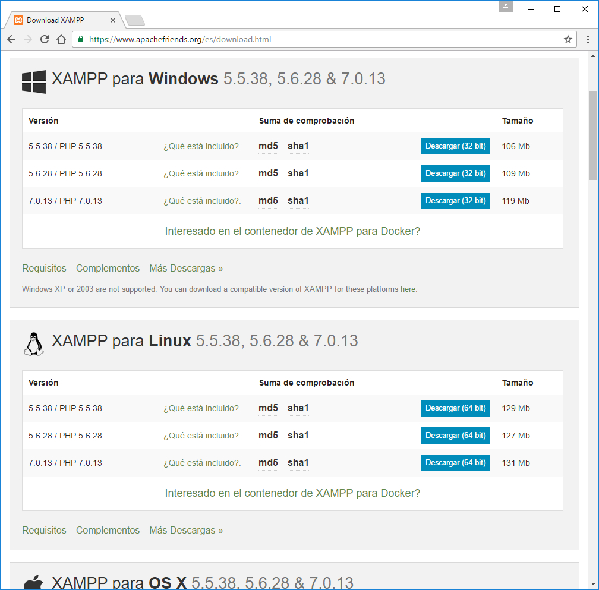
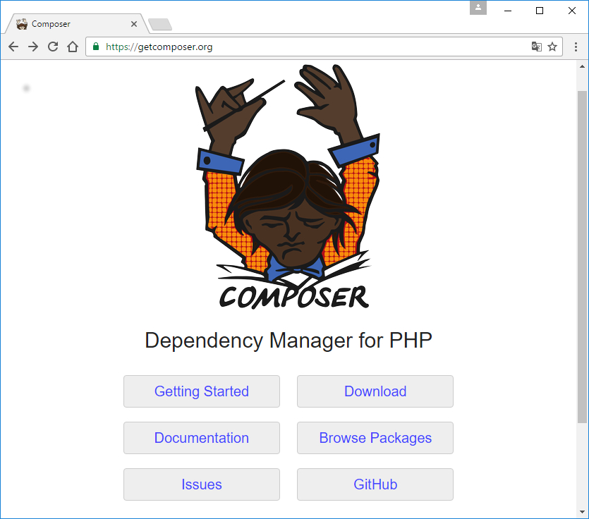
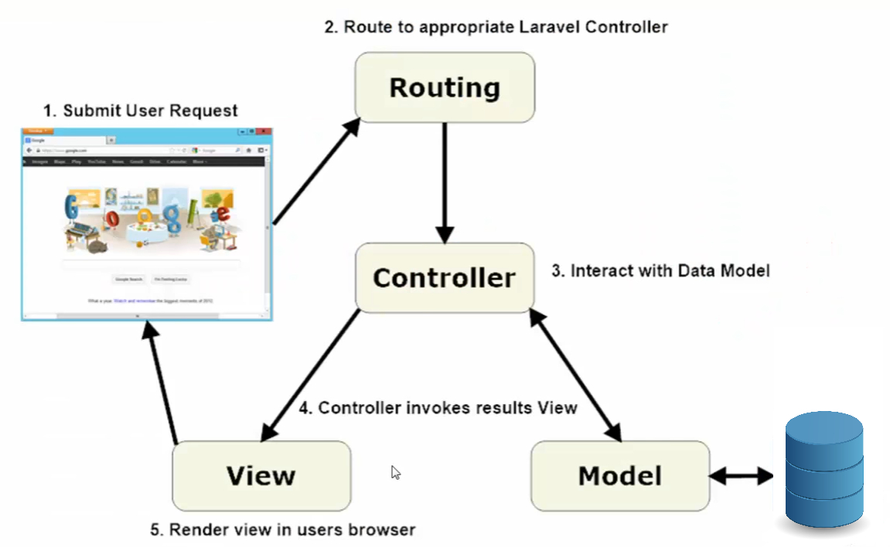

# LARAVEL

Laravel es un framework de código abierto para desarrollar aplicaciones y servicios web con PHP. Su filosofía es desarrollar código PHP de forma elegante y simple, evitando el "código espagueti". Fue creado en 2011 y tiene una gran influencia de frameworks como Ruby on Rails, Sinatra y ASP.NET MVC.

# Configuración previa.

* Tener un servidor web y composer

1- En este tutorial utilizaremos XAMPP que es un paquete que permite levantar un servidor apache y utilizar bases de datos MySQL.

Instalar [XAMPP](https://www.apachefriends.org/es/download.html)



2- Composer es una herramienta de administración de dependencias para PHP. Está altamente inspirado en el NPM de NODEJS o el Bundler de Ruby. Para instalar composer entramos en [https://getcomposer.org](https://getcomposer.org/), hacemos clic en Download e instalamos el paquete que corresponda a nuestro Sistema Operativo.



Una vez realizada la configuración inicial podemos comenzar con la instalación de [LARAVEL](https://laravel.com/docs/). Para ello nos colocamos en c:\xampp\htdocs y ejecutamos el siguiente comando:


```bash
composer create-project --prefer-dist laravel/laravel nombre_proyecto
```

Por último activamos nuestro servidor apache en XAMPP y si todo ha salido bien deberíamos poder entrar a nuestro sitio web Instalar [localhost/nombre_proyecto/public](localhost/nombre_proyecto/public)

De forma opcional podemos acortar la URL a [localhost:8000](localhost:8000) escribiendo el siguiente comando:

```bash
php artisan serve
```

**Artisan** es el nombre de la interfaz de línea de comandos incluida en Laravel. Provee comandos útiles para el desarrollo de tu aplicación. Está impulsada por el poderoso componente Console de Symfony.


# ¿Cómo funcion LARAVEL?




#VISTAS

Se encuentran dentro del directorio **resources/views** , es el resultado final que se muestra en el navegador.

#RUTAS

Se encuentran dentro del directorio **routes** , las rutas pueden retornar una vista aunque lo correcto es que llamen a un controlador y este sea quien retorne la vista o llame a un modelo, dependiendo si se realiza alguna petición a una base de datos.

*Ejemplo de rutas: 

```bash
Route::get('/', function () {
    return view('welcome');
});

Route::get('/productos', function () {
$productos = App\Productos::all();
return $productos;
});

Route::get('/nosotros', 'PaginasController@nosotros');


```

#CONTROLADORES

Se encuentran dentro del directorio **app/Http/Controllers**

*Ejemplo de un controlador:

```bash
<?php
namespace App\Http\Controllers;
use App\User;
use App\Http\Controllers\Controller;
class PaginasController extends Controller
{
    
    public function nosotros(){
      $nombre='Merquis';
      return view('nosotros')->with([
        'nombre' =>'Merquis',
        'apellido' => 'Cruz']);
    }

}
```

#BLADE

**Blade** es el motor de plantillas de **Laravel** y permite desarrollar código de forma más rápida y limpia.

#MIGRACIONES

Podríamos decir que son un tipo de control de versiones para nuestra base de datos.
¿Cómo crear una migración?

En este ejemplo creamos una tabla llamada productos.

```bash
php artisan make:migration productos_migration --create productos

php artisan migrate:install

php artisan migrate

php artisan make:model Productos
```

#ELOQUENT

**Eloquent** es el ORM que incluye Laravel para manejar de una forma fácil y sencilla los procesos correspondientes al manejo de bases de datos en nuestro proyecto, gracias a las funciones que provee podremos realizar complejas consultas y peticiones de base de datos sin escribir una sola línea de código SQL.


* Autor: [Merquis Jesús Cruz Veloz](https://github.com/alu0100536690)
* Fecha: 09/12/2016


* Autor: [Merquis Jesús Cruz Veloz](https://github.com/alu0100536690)
* Fecha: 09/12/2016
